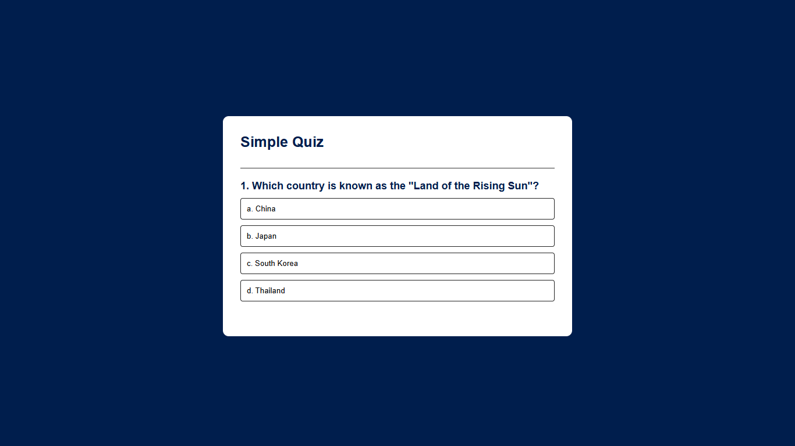

# Quiz App

A simple and responsive **Quiz Application** built with **HTML, CSS, and JavaScript** for practicing general knowledge, history, and science questions. Designed especially with **BCS exam preparation** in mind, this app offers a clean interface and immediate feedback on answers.

## 🔍 Features

- Multiple-choice quiz format
- Score tracking
- Instant answer validation
- Responsive and clean UI
- Restart option at the end of the quiz

## 🚀 Technologies Used

- HTML5
- CSS3
- JavaScript (Vanilla)

## 📺 Live Demo

👉 [Click here to try the Quiz App](https://musayahea-pro.github.io/Quiz)

## 📸 Screenshot

